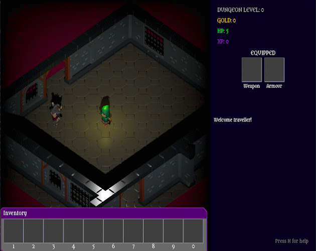

# DungeonGame - Desparately Dangerous Dungeons

An isometric 3d rogue like.

Entry to LibGDX game jame #31 (November 2024).

Jam review here: https://www.youtube.com/watch?v=_JAz2ziBVLs (starts at 2h12)

Play it here: https://monstrous-software.itch.io/desperately-dangerous-dungeons

## Platforms

- `core`: Main module with the application logic shared by all platforms.
- `lwjgl3`: Primary desktop platform using LWJGL3; was called 'desktop' in older docs.
- `teavm`: Experimental web platform using TeaVM and WebGL.

